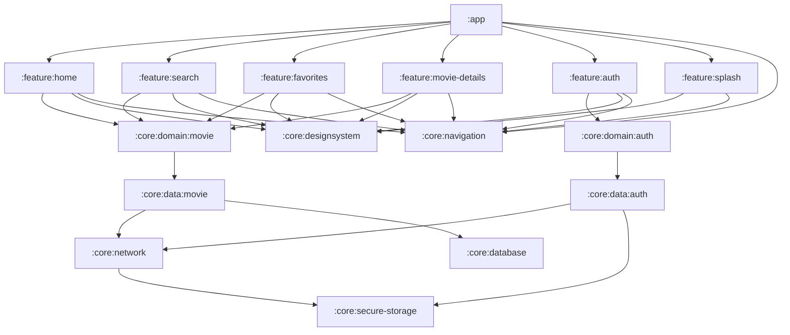

# 🎬 NowInMovie


> ✨ A modern Android movie browsing app built with **Jetpack Compose**, **Clean Architecture**, and
> inspired by [NowInAndroid](https://github.com/android/nowinandroid).

---

## 🚀 Features

- 🔥 **Movie Discovery**
  - Trending, Popular, Top Rated, Upcoming categories
  - Smooth animations & elegant UI
- 🔍 **Smart Search**
  - Search by movie title, actor, or genre
  - Real-time suggestions as you type
- 🎭 **Detailed Movie Info**
  - Cast, crew, ratings, trailers, and similar movies
- 🔐 **TMDB Authentication**
  - Secure login with your own API key
- ❤️ **Favorites Collection**
  - Save and manage your favorite movies
  - Stored locally for quick access

---

## 📱 Screenshots

| Home                                 | Search                                   | Favorites                                      |
|--------------------------------------|------------------------------------------|------------------------------------------------|
|  |  |  |

| Movie Details                                      | Cast & Info                                         |
|----------------------------------------------------|-----------------------------------------------------|
|  |  |

---

## 🏗️ Architecture Overview

**Clean Architecture + Multi-Module Design**

```
nowinmovie/
├── :app
├── :build-logic
├── :core/
│   ├── :data/
│   │   ├── :auth
│   │   └── :movie
│   ├── :database
│   ├── :designsystem
│   ├── :domain/
│   │   ├── :auth
│   │   └── :movie
│   ├── :navigation
│   ├── :network
│   └── :secure-storage
└── :feature/
    ├── :auth
    ├── :favorites
    ├── :home
    ├── :movie-details
    ├── :search
    └── :splash
```

### 🧠 Design Patterns

- 🔄 **MVI (Model-View-Intent)** – Unidirectional data flow
- 🎯 **MVVM (Model-View-ViewModel)** – Better separation of concerns

---

## ⚙️ Tech Stack

### 🖼️ UI & Presentation

- [Jetpack Compose](https://developer.android.com/jetpack/compose)
- [Navigation Compose](https://developer.android.com/jetpack/compose/navigation)
- [Coil](https://coil-kt.github.io/coil/) – Image loading

### 📦 Architecture & Data

- [Hilt](https://dagger.dev/hilt/) – Dependency Injection
- [Room](https://developer.android.com/training/data-storage/room) – Local DB
- [Retrofit](https://square.github.io/retrofit/) – Networking
- [Paging 3](https://developer.android.com/topic/libraries/architecture/paging/v3-overview) –
  Pagination

### 📈 Monitoring & Tooling

- [Firebase Performance](https://firebase.google.com/docs/perf-mon) - Performance monitoring
- [Firebase Crashlytics](https://firebase.google.com/docs/crashlytics)
- [KSP](https://github.com/google/ksp) – Kotlin Symbol Processing

---

## 🧩 Module Dependency Graph



---

## 🧪 Getting Started

1. **Clone the repository:**

```bash
git clone https://github.com/amirnlz/nowinmovie.git
```

2. **Open with Android Studio**

3. **Add your TMDB API key**

- Register at [TMDB](https://www.themoviedb.org/)
- Paste your key into the login screen when prompted

4. **Build & Run**

---

## 🎯 Project Goals

- ✅ Showcase modern Android development best practices
- ✅ Build a scalable, maintainable architecture using modular design
- ✅ Deliver a beautiful and intuitive UI with Jetpack Compose
- ✅ Provide a robust learning resource for aspiring Android developers

---

## 🤝 Contributing

I'd love to have your contributions to make NowInMovie even better! ❤️

### 💡 Ways to Contribute

- **🐛 Found a bug?** - Open an issue describing the bug and how to reproduce it
- **🎨 Have a feature idea?** - Suggest new features or improvements through issues
- **👨‍💻 Want to code?** - Fork the repo and submit a pull request with your improvements

### 🛠️ How to Contribute

```bash
# 1. Fork the repository
# 2. Create your branch
git checkout -b feature/AmazingFeature

# 3. Commit your changes
git commit -m "Add some AmazingFeature"

# 4. Push to your fork
git push origin feature/AmazingFeature

# 5. Open a Pull Request
```

### ✨ Guidelines

- Follow [Kotlin style guide](https://developer.android.com/kotlin/style-guide)
- Write clean, self-explanatory code
- Document new modules and classes where needed

---

## 📄 License

This project is licensed under the MIT License – see the [LICENSE](./LICENSE) file for details.

---

## 🙏 Acknowledgements

- Inspired by [NowInAndroid](https://github.com/android/nowinandroid)
- Powered by [TMDB](https://www.themoviedb.org/) API
- Thanks to all the amazing [open-source libraries](#-tech-stack) that made this project possible

---

> Made with ❤️ by [Amirnlz](https://github.com/amirnlz)