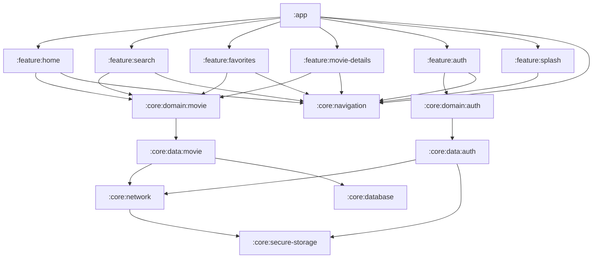

# 🎬 NowInMovie


> A modern Android movie browsing application inspired by Google's "NowInAndroid" project, built
> with Clean Architecture and the latest Android development practices.

## ✨ Features

- **🔥 Movie Discovery**
  - Browse Trending, Popular, TopRated, and Upcoming movies
  - Clean UI with smooth transitions and animations
- **🔍 Smart Search**
  - Find movies by title, actor, or genre
  - Get instant search results as you type
- **🎭 Rich Movie Details**
  - View comprehensive information about movies
  - See cast, crew, ratings, and related content
- **🔐 TMDB Authentication**
  - Connect with your TMDB API key
  - Seamless integration with TMDB services
- **❤️ Favorites Collection**
  - Save movies to your personal collection
  - Locally stored for quick access

## 📱 Screenshots

|             |            |  |
|--------------------------------------------------------|-----------------------------------------------------------|------------------------------------------------|
|  |  |                                                |

## 🏗️ Architecture

NowInMovie follows Clean Architecture principles with a multi-module approach, separating concerns
into independent, reusable modules:

```
nowinmovie/
├─ :app                   # Main application module
├─ :build-logic           # Build configuration and convention plugins
├─ :core/                 # Core modules with shared functionality
│  ├─ :data               # Data layer implementation
│  │  ├─ :auth            # Authentication data sources and repositories
│  │  └─ :movie           # Movie data sources and repositories
│  ├─ :database           # Local database implementation
│  ├─ :domain             # Business logic and use cases
│  │  ├─ :auth            # Authentication domain models and use cases
│  │  └─ :movie           # Movie domain models and use cases
│  ├─ :navigation         # Navigation components
│  ├─ :network            # Network communication
│  └─ :secure-storage     # Secure data storage for API keys
└─ :feature/              # Feature modules
├─ :auth               # Authentication feature
├─ :favorites          # User favorites management
├─ :home               # Home screen
├─ :movie-details      # Movie detail pages
├─ :search             # Search functionality
└─ :splash             # Splash screen
```

### 🔄 Patterns

- **MVI (Model-View-Intent)**: For unidirectional data flow and predictable state management
- **MVVM (Model-View-ViewModel)**: For separation of concerns and testability

## 🛠️ Tech Stack

### UI & Presentation

- **[Jetpack Compose](https://developer.android.com/jetpack/compose)** - Modern declarative UI
  toolkit
- **[Navigation Compose](https://developer.android.com/jetpack/compose/navigation)** - Navigation
  between screens
- **[Coil](https://coil-kt.github.io/coil/)** - Image loading library

### Architecture & Data Management

- **[Hilt](https://dagger.dev/hilt/)** - Dependency injection
- **[Room](https://developer.android.com/training/data-storage/room)** - Local database for
  favorites
- **[Retrofit](https://square.github.io/retrofit/)** - Network communication with TMDB API
- **[Paging 3](https://developer.android.com/topic/libraries/architecture/paging/v3-overview)** -
  Data pagination

### Tools & Services

- **[Firebase Analytics](https://firebase.google.com/docs/analytics)** - Performance monitoring
- **[Firebase Performance](https://firebase.google.com/docs/perf-mon)** - Performance monitoring
- **[Firebase Crashlytics](https://firebase.google.com/docs/crashlytics)** - Crash reporting
- **[KSP](https://github.com/google/ksp)** - Kotlin Symbol Processing

## 📊 Module Dependency Graph

<!-- Module Dependency Graph -->


