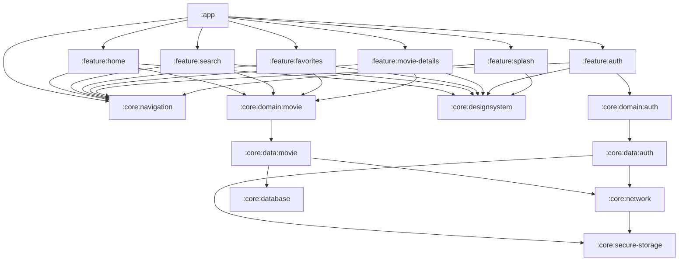

# 🎬 NowInMovie


> A modern Android movie browsing application inspired by Google's "NowInAndroid" project, built
> with Clean Architecture and the latest Android development practices.

## ✨ Features

- **🔥 Movie Discovery**
  - Browse Trending, Popular, TopRated, and Upcoming movies
  - Clean UI with smooth transitions and animations
- **🔍 Smart Search**
  - Find movies by title, actor, or genre
  - Get instant search results as you type
- **🎭 Rich Movie Details**
  - View comprehensive information about movies
  - See cast, crew, ratings, and related content
- **🔐 TMDB Authentication**
  - Connect with your TMDB API key
  - Seamless integration with TMDB services
- **❤️ Favorites Collection**
  - Save movies to your personal collection
  - Locally stored for quick access

## 📱 Screenshots

|             |            |  |
|--------------------------------------------------------|-----------------------------------------------------------|------------------------------------------------|
|  |  |                                                |

## 🏗️ Architecture

NowInMovie follows Clean Architecture principles with a multi-module approach, separating concerns
into independent, reusable modules:

```
nowinmovie/
├─ :app                   # Main application module
├─ :build-logic           # Build configuration and convention plugins
├─ :core/                 # Core modules with shared functionality
│  ├─ :data               # Data layer implementation
│  │  ├─ :auth            # Authentication data sources and repositories
│  │  └─ :movie           # Movie data sources and repositories
│  ├─ :database           # Local database implementation
│  ├─ :designsystem       # UI components, themes, and styling
│  ├─ :domain             # Business logic and use cases
│  │  ├─ :auth            # Authentication domain models and use cases
│  │  └─ :movie           # Movie domain models and use cases
│  ├─ :navigation         # Navigation components
│  ├─ :network            # Network communication
│  └─ :secure-storage     # Secure data storage for API keys
└─ :feature/              # Feature modules
   ├─ :auth               # Authentication feature
   ├─ :favorites          # User favorites management
   ├─ :home               # Home screen
   ├─ :movie-details      # Movie detail pages
   ├─ :search             # Search functionality
   └─ :splash             # Splash screen
```

### 🔄 Patterns

- **MVI (Model-View-Intent)**: For unidirectional data flow and predictable state management
- **MVVM (Model-View-ViewModel)**: For separation of concerns and testability

## 🛠️ Tech Stack

### UI & Presentation

- **[Jetpack Compose](https://developer.android.com/jetpack/compose)** - Modern declarative UI
  toolkit
- **[Navigation Compose](https://developer.android.com/jetpack/compose/navigation)** - Navigation
  between screens
- **[Coil](https://coil-kt.github.io/coil/)** - Image loading library

### Architecture & Data Management

- **[Hilt](https://dagger.dev/hilt/)** - Dependency injection
- **[Room](https://developer.android.com/training/data-storage/room)** - Local database for
  favorites
- **[Retrofit](https://square.github.io/retrofit/)** - Network communication with TMDB API
- **[Paging 3](https://developer.android.com/topic/libraries/architecture/paging/v3-overview)** -
  Data pagination

### Tools & Services

- **[Firebase Analytics](https://firebase.google.com/docs/analytics)** - Performance monitoring
- **[Firebase Performance](https://firebase.google.com/docs/perf-mon)** - Performance monitoring
- **[Firebase Crashlytics](https://firebase.google.com/docs/crashlytics)** - Crash reporting
- **[KSP](https://github.com/google/ksp)** - Kotlin Symbol Processing

## 📊 Module Dependency Graph

<!-- Module Dependency Graph -->



### Setup

1. Clone the repository

```bash
git clone https://github.com/amirnlz/nowinmovie.git
```

2. Open the project in Android Studio

3. Add your TMDB API key

- Register at [TMDB](https://www.themoviedb.org/) to get your API key
- Enter your API key in the authentication screen

4. Build and run the app

## 🧩 Why This Project?

NowInMovie was developed to demonstrate modern Android development practices and architectural
patterns. The project showcases:

- **Modular Architecture**: Separation of concerns for better maintainability and scalability
- **Clean Architecture**: Clear boundaries between layers for testability and flexibility
- **Modern UI**: Fluid and responsive user interface built with Jetpack Compose
- **Best Practices**: Following industry standards and Google-recommended patterns

## 🤝 Contributing

I'd love to have your contributions to make NowInMovie even better! Here's how you can help:

### Ways to Contribute

- **🐛 Found a bug?** - Open an issue describing the bug and how to reproduce it
- **🎨 Have a feature idea?** - Suggest new features or improvements through issues
- **👨‍💻 Want to code?** - Fork the repo and submit a pull request with your improvements

### Contribution Process

1. Fork the Project
2. Create your Feature Branch (`git checkout -b feature/AmazingFeature`)
3. Commit your Changes (`git commit -m 'Add some AmazingFeature'`)
4. Push to the Branch (`git push origin feature/AmazingFeature`)
5. Open a Pull Request

### Coding Standards

- Follow Kotlin coding conventions
- Keep code clean and well-documented

Your contributions, big or small, are greatly appreciated and will help make this project better for
everyone!

## 📄 License

```
MIT License

Copyright (c) 2023 Amir Norozpour

Permission is hereby granted, free of charge, to any person obtaining a copy
of this software and associated documentation files (the "Software"), to deal
in the Software without restriction, including without limitation the rights
to use, copy, modify, merge, publish, distribute, sublicense, and/or sell
copies of the Software, and to permit persons to whom the Software is
furnished to do so, subject to the following conditions:

The above copyright notice and this permission notice shall be included in all
copies or substantial portions of the Software.

THE SOFTWARE IS PROVIDED "AS IS", WITHOUT WARRANTY OF ANY KIND, EXPRESS OR
IMPLIED, INCLUDING BUT NOT LIMITED TO THE WARRANTIES OF MERCHANTABILITY,
FITNESS FOR A PARTICULAR PURPOSE AND NONINFRINGEMENT. IN NO EVENT SHALL THE
AUTHORS OR COPYRIGHT HOLDERS BE LIABLE FOR ANY CLAIM, DAMAGES OR OTHER
LIABILITY, WHETHER IN AN ACTION OF CONTRACT, TORT OR OTHERWISE, ARISING FROM,
OUT OF OR IN CONNECTION WITH THE SOFTWARE OR THE USE OR OTHER DEALINGS IN THE
SOFTWARE.
```

## 🙏 Acknowledgments

- Inspired by Google's [NowInAndroid](https://github.com/android/nowinandroid) project
- Thanks to [TMDB](https://www.themoviedb.org/) for the movie database API
- All the awesome open-source libraries that made this project possible